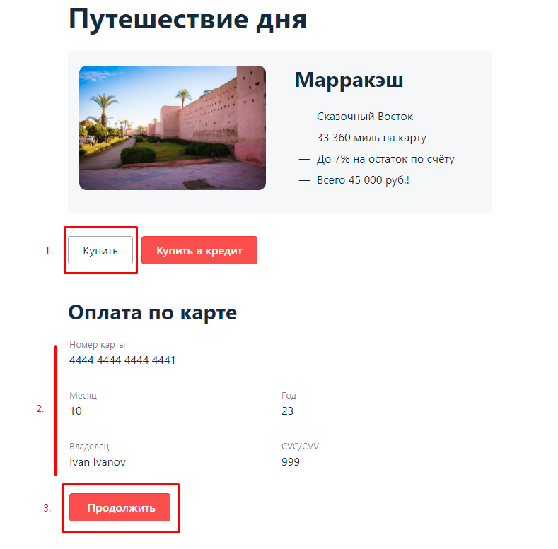
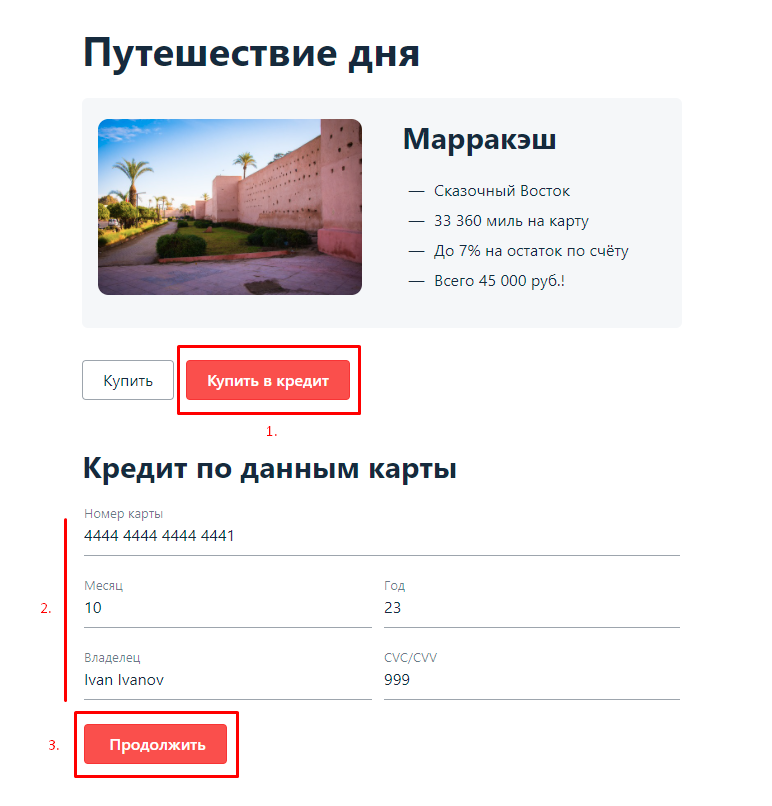

## План автоматизации тестирования веб-сервиса покупки туров

### Перечень автоматизируемых сценариев

#### Позитивные сценарии:

1)Покупка тура по валидной дебетовой карте:


Шаги воспроизведения:
1) На главной странице веб-сервиса нажать кнопку **Купить**
2) Заполнить поля формы валидными данными:

    ```
    Номер карты: 4444 4444 4444 4441
    Месяц: 10
    Год: 23
    Владелец: Ivan Ivanov
    CVC/CVV код: 999

3) Нажать кнопку **Продолжить**
4) Ожидать и наблюдать результат запроса в банк

Ожидаемый результат: Запрос в банк успешен. Появляется сообщение с текстом "Операция одобрена Банком.".

---

2)Покупка тура по невалидной дебетовой карте:

Шаги воспроизведения:
1) На главной странице веб-сервиса нажать кнопку **Купить**
2) Заполнить поля формы валидными данными:

   ```
   Номер карты: 4444 4444 4444 4442
   Месяц: 10
   Год: 23
   Владелец: Ivan Ivanov
   CVC/CVV код: 999

3) Нажать кнопку **Продолжить**
4) Ожидать и наблюдать результат запроса в банк

Ожидаемый результат: Запрос в банк неуспешен. Появляется сообщение с текстом "Ошибка! Банк отказал в проведении операции.".

---

3)Покупка по валидной карте в кредит:


Шаги воспроизведения:
1) На главной странице веб-сервиса нажать кнопку **Купить в кредит**
2) Заполнить поля формы валидными данными:

   ``` 
   Номер карты: 4444 4444 4444 4441
   Месяц: 10
   Год: 23
   Владелец: Ivan Ivanov
   CVC/CVV код: 999

3) Нажать кнопку **Продолжить**
4) Ожидать и наблюдать результат запроса в банк

Ожидаемый результат: Запрос в банк успешен. Появляется сообщение с текстом "Успешно. Операция одобрена Банком.".

---

4)Покупка по невалидной карте в кредит:

Шаги воспроизведения:
1) На главной странице веб-сервиса нажать кнопку **Купить в кредит**
2) Заполнить поля формы валидными данными:

   ```
   Номер карты: 4444 4444 4444 4442
   Месяц: 10
   Год: 23
   Владелец: Ivan Ivanov
   CVC/CVV код: 999

3) Нажать кнопку **Продолжить**
4) Ожидать и наблюдать результат запроса в банк

Ожидаемый результат: Запрос в банк неуспешен. Появляется сообщение с текстом "Ошибка! Банк отказал в проведении операции.".

#### Негативные сценарии:

Тесты относятся ко всем типам покупок (покупка по дебетовой карте/покупка по карте в кредит) и всем типам карт (валидная/невалидная)

1)Покупка тура по карте - отправка пустых полей формы:

Шаги воспроизведения:
1) На главной странице веб-сервиса нажать кнопку **Купить**/**Купить в кредит**
2) Оставить поля формы незаполненными:

   ```
   Номер карты: 
   Месяц: 
   Год: 
   Владелец: 
   CVC/CVV код: 

3) Нажать кнопку **Продолжить**
4) Ожидать и наблюдать результат запроса в банк

Ожидаемый результат: Запрос в банк не отправлен. Под каждым полей появилось валидационное сообщение "Поле обязательно для заполнения".

---

2)Покупка тура по карте - отправка формы с невалидными данным в поле **Номер карты** (Номер карты не из набора)

Шаги воспроизведения:
1) На главной странице веб-сервиса нажать кнопку **Купить**/**Купить в кредит**
2) Заполнить поля формы валидными данным кроме поля **Номер карты**:

   ```
   Номер карты: 1111 2222 3333 4444
   Месяц: 10
   Год: 23
   Владелец: Ivan Ivanov
   CVC/CVV код: 999

3) Нажать кнопку **Продолжить**
4) Ожидать и наблюдать результат запроса в банк

Ожидаемый результат: 
- Под полем **Номер карты** появилось валидационное сообщение "Неверный формат".
- Запрос в банк неуспешен. Появляется сообщение с текстом "Ошибка! Банк отказал в проведении операции.".

---

3)
- номер карты (меньше 16 цифр)
- но несуществующий месяц (77)
- но неверный формат месяца (1)
- но прошедший год (10)
- но неверный формат года (2)
- но неверно указан год в сроке действия (90 - слишком будущий видимо)
- но неверный формат CVС/CVV кода (11)
- но неверное имя владельца (цифры в имени)
- но неверное имя владельца (символы в имени)
- но неверное имя владельца (цифры и символы в имени)
- но неверное имя владельца (имя на кириллице)
- но неверное имя владельца (часть имени на кириллице, часть на латинице)
- но неверное имя владельца (цифры вместо букв)
- но неверное имя владельца (символы вместо букв)
- но неверное имя владельца (символы и цифры вместо букв)

### Перечень используемых инструментов с обоснованием выбора

- IntelliJ IDEA - среда разработки ПО для написания кода проекта;
- Java 11 - язык программирования проекта;
- JUnit5 - библиотека для модульного тестирования ПО на языке Java;
- Git - распределённая система управления версиями, позволяет фиксировать изменения в коде;
- Gradle - система для автоматизации сборки проектов;
- Selenide - фреймворк для автоматизированного UI тестирования веб-приложений;
- SQL - язык структурированных запросов, предназначенным для описания, изменения и извлечения данных, хранимых в реляционных базах данных;
- Allure - создание наглядной отчётности по результатам тестирования;
- Docker - для разворачивания СУБД MySQL и PostgreSQL, а также Node.js и дальнейшего тестирования приложения;
- Faker - ???
- Lombok - ???
[comment]: <> (- Appveyor - веб-сервис непрерывной интеграции, предназначенный для сборки и тестирования программного обеспечения расположенного на GitHub)

### Перечень и описание возможных рисков при автоматизации

1) Проблемы с соединением/сетью (зависимость тестового окружения от бесперебойной и качественной сети Интернет); 
2) Возможное отсутствие доступа к БД; 
3) Утечка данных банковских карт;
4) Может требоваться рефакторинг тестов при изменениях со временем; 
5) Тесты не могут покрывать все возможные тестовые сценарии;
6) Проблемы с запуском SUT и подготовкой тестового окружения в связи с использованием большого перечня трудоёмких инструментов;
7) Наличие различных багов в тестируемом приложении;
8) Трудности с поиском необходимых CSS-селекторов для UI тестирования (из-за отсутствия атрибутов "test-id"); 
9) Сложности, связанные с необходимостью работы сразу с двумя БД - MySQL и PostgreSQL.

### Интервальная оценка с учётом рисков (в часах)

- Планирование - 96 часов (4 дня);
- Автоматизация - 336 часов (14 дней);
- Отчётные документы по итогам тестирования - 72 часа (3 дня);
- Отчётные документы по итогам автоматизации - 96 часов (4 дня);
- Риски (+ 72 часа (3 дня)).

Итого: С учётом возможных рисков и сложностей - ** 672 часа (28 дней)**.

### План сдачи работ (когда будут авто-тесты, результаты их прогона и отчёт по автоматизации)

- Сдача авто-тестов к **23.09**
- Сдача результата их прогона к **26.09**
- Сдача отчёта по автоматизации к **30.09**
- Вся работа к **3.10-4.10**